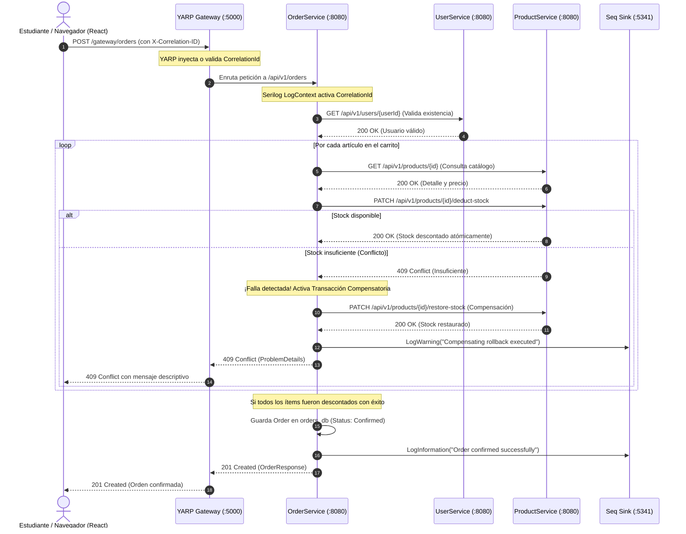

# Guía Maestra de Arquitectura de Microservicios
## Sistema de Referencia Académico y Práctico (.NET 8, YARP, PostgreSQL, React 18 & Seq)

[](https://dotnet.microsoft.com/)
[](https://microsoft.github.io/reverse-proxy/)
[](https://www.postgresql.org/)
[](https://react.dev/)
[](https://datalust.co/seq)
[](https://www.docker.com/)

Repositorio oficial y guía de estudio desarrollada para la cátedra de **Arquitectura de Software (Universidad Popular del Cesar - Unicesar, 2026)**. Este proyecto materializa los principios teóricos fundamentales de los sistemas distribuidos mediante una implementación rigurosa, moderna y completamente funcional en **ASP.NET Core 8**, proxy inverso de borde con **YARP**, persistencia desacoplada con **PostgreSQL**, observabilidad centralizada con **Serilog + Seq**, resiliencia con **Polly v8** y un cliente web reactivo en **Next.js / React 18**.

---

## 📑 Tabla de Contenidos
1. [🧭 Acceso al Portal de Diagramas de Arquitectura](#-acceso-al-portal-de-diagramas-de-arquitectura)
2. [🎯 Caso de Negocio y Justificación Arquitectónica](#-caso-de-negocio-y-justificación-arquitectónica)
3. [📚 Fundamentos Teóricos de Sistemas Distribuidos y Microservicios](#-fundamentos-teóricos-de-sistemas-distribuidos-y-microservicios)
   - [3.1 Monolitos vs. Microservicios y Ley de Conway](#31-monolitos-vs-microservicios-y-ley-de-conway)
   - [3.2 Teoremas de CAP y PACELC](#32-teoremas-de-cap-y-pacelc)
   - [3.3 Domain-Driven Design (DDD) y Bounded Contexts](#33-domain-driven-design-ddd-y-bounded-contexts)
   - [3.4 Patrón Database-per-Service](#34-patrón-database-per-service)
   - [3.5 Patrón API Gateway y Reverse Proxy (YARP)](#35-patrón-api-gateway-y-reverse-proxy-yarp)
   - [3.6 Trazabilidad Distribuida y Correlation ID](#36-trazabilidad-distribuida-y-correlation-id)
   - [3.7 Transacciones Distribuidas: Saga y Compensación](#37-transacciones-distribuidas-saga-y-compensación)
   - [3.8 Patrones de Resiliencia y Tolerancia a Fallos (Polly v8)](#38-patrones-de-resiliencia-y-tolerancia-a-fallos-polly-v8)
   - [3.9 Observabilidad Estructurada (CLEF & Seq)](#39-observabilidad-estructurada-clef--seq)
   - [3.10 Spec-Driven Development (SDD)](#310-spec-driven-development-sdd)
4. [🏗️ Topología del Sistema y Mapa de Componentes](#️-topología-del-sistema-y-mapa-de-componentes)
5. [🔄 Anatomía de una Transacción: El Flujo de Checkout y Compensación](#-anatomía-de-una-transacción-el-flujo-de-checkout-y-compensación)
6. [🚀 Guía de Puesta en Marcha Rápida](#-guía-de-puesta-en-marcha-rápida)
7. [🧪 Laboratorios Prácticos de Estudio (Hands-on Labs)](#-laboratorios-prácticos-de-estudio-hands-on-labs)
   - [Lab 1: Topología de Red y Contenedores con Docker](#lab-1-topología-de-red-y-contenedores-con-docker)
   - [Lab 2: Trazabilidad Distribuida End-to-End en Seq](#lab-2-trazabilidad-distribuida-end-to-end-en-seq)
   - [Lab 3: Prueba de Resiliencia y Transacción Compensatoria (Saga Rollback)](#lab-3-prueba-de-resiliencia-y-transacción-compensatoria-saga-rollback)
   - [Lab 4: Simulación de Caída de Servicio y Circuit Breaker](#lab-4-simulación-de-caída-de-servicio-y-circuit-breaker)
   - [Lab 5: Inspección de Persistencia Aislada](#lab-5-inspección-de-persistencia-aislada)
8. [❓ Cuestionario de Autoevaluación para Exámenes](#-cuestionario-de-autoevaluación-para-exámenes)
9. [📖 Glosario de Términos Arquitectónicos](#-glosario-de-términos-arquitectónicos)
10. [📐 Estructura Detallada del Repositorio](#-estructura-detallada-del-repositorio)

---

## 🧭 Acceso al Portal de Diagramas de Arquitectura

El proyecto incorpora un **Portal Interactivo de Diagramas Editoriales** en modo oscuro diseñado bajo estándares de alta fidelidad estética para el análisis visual del sistema:

> 🌐 **Ver Portal de Diagramas en la Aplicación Web:**  
> Con el sistema en ejecución, accede directamente a:  
> [**`http://localhost:3000/diagrams/index.html`**](http://localhost:3000/diagrams/index.html) o haz clic en el botón **"Diagramas de Arquitectura"** en la barra superior o menú lateral de la aplicación.
>
> 📁 **Ver Archivos Locales en el Repositorio:**  
> Puedes abrir directamente en cualquier navegador el portal central: [**`docs/diagrams/index.html`**](docs/diagrams/index.html).

### Catálogo de Diagramas Disponibles
| # | Tipo de Diagrama | Archivo | Dimensión Arquitectónica Representada |
|---|---|---|---|
| **01** | **Architecture Topology** | [`microservices-architecture-dark.html`](docs/diagrams/microservices-architecture-dark.html) | Topología física y lógica general, enrutamiento YARP, puertos y sumidero unificado Seq. |
| **02** | **Sequence Diagram** | [`correlation-id-sequence-dark.html`](docs/diagrams/correlation-id-sequence-dark.html) | Ciclo de vida y propagación de `X-Correlation-ID` desde React (Axios) hasta Seq. |
| **03** | **Deployment Diagram** | [`docker-deployment-dark.html`](docs/diagrams/docker-deployment-dark.html) | Contenedores Docker Compose, aislamiento en red virtual `microservices-net` y volúmenes persistentes. |
| **04** | **State Machine** | [`order-state-machine-dark.html`](docs/diagrams/order-state-machine-dark.html) | Ciclo de vida de órdenes, transiciones de estado y orquestación compensatoria (Saga). |
| **05** | **Database Schema** | [`database-schema-dark.html`](docs/diagrams/database-schema-dark.html) | Esquemas DDL físicos de PostgreSQL (*database-per-service*) y claves foráneas lógicas. |
| **06** | **Resilience Flowchart** | [`resilience-flowchart-dark.html`](docs/diagrams/resilience-flowchart-dark.html) | Lógica de decisión del Gateway, sondeos `/health`, reintentos, Circuit Breaker y fallback. |

---

## 🎯 Caso de Negocio y Justificación Arquitectónica

### El Problema del Monolito Tradicional
En un sistema monolítico clásico de comercio electrónico, los módulos de autenticación, catálogo de productos e inventario, y gestión de pedidos residen dentro del mismo proceso en memoria y comparten una única base de datos relacional:
* **Acoplamiento Fuerte:** Un cambio en la tabla de usuarios puede invalidar consultas o migraciones en facturación o pedidos.
* **Cascada de Fallos (Single Point of Failure):** Si una consulta lenta en el módulo de reportes o un desbordamiento de memoria ocurre al procesar pagos, toda la aplicación se detiene: los usuarios no pueden iniciar sesión ni explorar el catálogo.
* **Escalabilidad Ineficiente:** Si el catálogo recibe un 95% de lecturas y los pedidos un 5% de escrituras, todo el monolito debe duplicarse por completo, consumiendo recursos innecesarios.
* **Opacidad Diagnóstica:** El rastreo de errores que atraviesan múltiples módulos mediante logs de texto plano tradicionales se convierte en una tarea inmanejable en producción.

### La Solución Distribuida Implementada
Esta solución descompone el dominio en **servicios atómicos y autónomos** orientados a dominios de negocio específicos:
1. **Identidad y Acceso (`UserService`):** Registro, login con hashing seguro de contraseñas y perfiles de usuario.
2. **Catálogo e Inventario (`ProductService`):** Exposición de catálogo de artículos y operaciones atómicas de deducción y restauración de existencias.
3. **Ventas y Facturación (`OrderService`):** Orquestación del proceso de compra, validación síncrona contra otros dominios y ejecución de rollback compensatorio en caso de conflicto.
4. **Punto de Entrada Unificado (`ApiGateway` con YARP):** Puerta de enlace perimetral que aísla la topología interna, expone endpoints semánticos, gestiona CORS y aplica cabeceras de telemetría.
5. **Observabilidad Estructurada Centralizada (`Seq`):** Sumidero de eventos JSON compacto (CLEF) que permite realizar búsquedas y correlaciones de trazas transversales en segundos.
6. **Experiencia de Usuario Reactiva (`Frontend Web`):** SPA en Next.js / React 18 que incluye una **Consola de Operaciones en Vivo** y barra de telemetría en tiempo real.

---

## 📚 Fundamentos Teóricos de Sistemas Distribuidos y Microservicios

Esta sección contiene el marco teórico esencial requerido para comprender y sustentar técnicamente este proyecto en la asignatura de Arquitectura de Software.

### 3.1 Monolitos vs. Microservicios y Ley de Conway

La **Ley de Conway (1968)** postula:
> *"Las organizaciones que diseñan sistemas están limitadas a producir diseños que son copias de las estructuras de comunicación de estas organizaciones."*

* **Monolito:** Adecuado para equipos pequeños (1 a 5 desarrolladores) con bajo volumen transaccional y modelos de dominio en fase exploratoria. Ofrece simplicidad inicial de despliegue y transacciones ACID nativas locales.
* **Microservicios:** Arquitectura de estilo distribuido donde cada servicio es:
  1. Independientemente desplegable.
  2. Altamente cohesivo y débilmente acoplado.
  3. Organizado alrededor de capacidades de negocio (*Business Capabilities*).
  4. Dueño de su propia persistencia de datos.

| Dimensión | Monolito Tradicional | Arquitectura de Microservicios |
|---|---|---|
| **Despliegue** | Unificado (Todo o Nada) | Autónomo e independiente por servicio |
| **Límite de Falla** | Todo el proceso colapsa | Aislado; degradación grácil de servicios |
| **Persistencia** | Base de datos única compartida | *Database-per-Service* estricto |
| **Escalabilidad** | Vertical u horizontal completa | Granular según la demanda del componente |
| **Transacciones** | ACID en una sola base de datos | Eventual Consistency / Patrón Saga |
| **Complejidad** | Baja en infraestructura, alta en código | Alta en orquestación y redes, baja por servicio |

---

### 3.2 Teoremas de CAP y PACELC

En sistemas distribuidos, el **Teorema de CAP (Eric Brewer, 2000)** demuestra que es imposible garantizar simultáneamente las tres propiedades siguientes en presencia de una partición de red:
* **Consistencia (Consistency - C):** Todo cliente recibe la lectura más reciente o un error.
* **Disponibilidad (Availability - A):** Toda petición no defectuosa recibe una respuesta no errónea (sin garantía de ser la más reciente).
* **Tolerancia a Particiones (Partition Tolerance - P):** El sistema sigue funcionando a pesar de pérdidas o retardos de mensajes entre nodos.

> Dado que las fallas de red son inevitables en cualquier red física o de contenedores, **la tolerancia a particiones (P) es obligatoria**. Por tanto, el arquitecto debe elegir entre **CP** o **AP**.

El **Teorema PACELC (Daniel Abadi, 2012)** amplía CAP:
* **Si hay una Partición (P):** ¿Cómo balancea el sistema Disponibilidad (**A**) vs. Consistencia (**C**)?
* **En caso contrario (Else - E):** ¿Cómo balancea el sistema Latencia (**L**) vs. Consistencia (**C**)?

#### Aplicación en esta Demo:
Este sistema favorece una postura **AP / PA-EL**:
* El sistema prioriza la **Disponibilidad**: los usuarios pueden consultar el catálogo o revisar pedidos anteriores incluso si el servicio de inventario se encuentra temporalmente degradado.
* Se abandona el modelo ACID tradicional a favor del modelo **BASE**:
  * **B**asically **A**vailable (Básicamente disponible).
  * **S**oft-state (Estado blando/cambiante sin necesidad de interacción externa continua).
  * **E**ventual consistency (Consistencia eventual tras el procesamiento de compensaciones).

---

### 3.3 Domain-Driven Design (DDD) y Bounded Contexts

El diseño de microservicios sin una delimitación de dominio adecuada conduce al peor de los escenarios: el **Monolito Distribuido** (un sistema con todos los dolores de la red y ninguna de las ventajas del desacoplamiento).

Para evitar esto, aplicamos principios de **Domain-Driven Design (Eric Evans, 2003)**:
1. **Contexto Delimitado (Bounded Context):** Frontera conceptual explícita dentro de la cual un modelo de dominio particular aplica de forma unívoca.
   * **Identity Context (`UserService`):** Modela conceptos como credenciales, perfiles, emails y autenticación.
   * **Catalog Context (`ProductService`):** Modela artículos, precios, descripciones, stock y referencias SKU.
   * **Sales Context (`OrderService`):** Modela intenciones de compra, carritos, líneas de pedido, totales y estados de orden.
2. **Lenguaje Ubicuo (Ubiquitous Language):** Términos técnicos y de negocio compartidos entre desarrolladores y expertos de dominio (ej. *Stock*, *SKU*, *Compensación*, *CorrelationId*).
3. **Agregados y Raíces de Agregado (Aggregate Roots):** La entidad `Order` es la raíz del agregado de ventas que encapsula y valida la colección de `OrderItem`. No es posible modificar un `OrderItem` sin pasar por la raíz `Order`.

---

### 3.4 Patrón Database-per-Service

Cada microservicio gestiona su propio motor y esquema de base de datos de manera exclusiva:
* `UserService` $\rightarrow$ `users_db` en PostgreSQL (`:5432`).
* `ProductService` $\rightarrow$ `products_db` en PostgreSQL (`:5433`).
* `OrderService` $\rightarrow$ `orders_db` en PostgreSQL (`:5434`).

```text
  [ UserService ]        [ ProductService ]        [ OrderService ]
         │                      │                        │
         ▼                      ▼                        ▼
  ┌──────────────┐       ┌──────────────┐         ┌──────────────┐
  │   users_db   │       │ products_db  │         │  orders_db   │
  │ (PostgreSQL) │       │ (PostgreSQL) │         │ (PostgreSQL) │
  └──────────────┘       └──────────────┘         └──────────────┘
         ▲                      ▲                        ▲
         │                      │                        │
         └─────────── PROHIBIDO ┴────────── PROHIBIDO ───┘
                 (No Cross-Database SQL / No JOINs)
```

#### ¿Por qué es una Regla de Oro?
1. **Encapsulamiento del Esquema:** Un servicio puede renombrar columnas, agregar índices o cambiar su motor (por ejemplo, migrar a MongoDB o Redis) sin consultar ni alterar a los demás microservicios.
2. **Aislamiento de Carga y Recursos:** Una consulta analítica pesada sobre el catálogo no bloquea las transacciones de escritura de pedidos ni satura el pool de conexiones de usuarios.
3. **Inexistencia de Claves Foráneas Físicas:** En `orders_db`, las columnas `user_id` y `product_id` se almacenan como identificadores lógicos de tipo `Guid` (UUID v4). La integridad referencial no la impone una restricción de clave externa en la base de datos, sino la lógica de aplicación en la capa de orquestación.

---

### 3.5 Patrón API Gateway y Reverse Proxy (YARP)

El cliente frontend jamás se comunica de manera directa con los microservicios individuales en sus puertos internos. En su lugar, todas las solicitudes ingresan a través de **YARP (Yet Another Reverse Proxy)** de Microsoft, alojado en el puerto `5000`:

#### Funciones Clave del API Gateway:
1. **Ocultamiento de la Topología de Red:** Los microservicios operan en la red virtual privada de Docker (`microservices-net`) sin exponer sus puertos al mundo exterior.
2. **Enrutamiento Declarativo:** Transforma rutas semánticas amigables para el cliente a las rutas de API internas correspondientes:
   * `/gateway/users/{**catch-all}` $\rightarrow$ `http://userservice:8080/api/v1/users/{**catch-all}`
   * `/gateway/products/{**catch-all}` $\rightarrow$ `http://productservice:8080/api/v1/products/{**catch-all}`
   * `/gateway/orders/{**catch-all}` $\rightarrow$ `http://orderservice:8080/api/v1/orders/{**catch-all}`
3. **Gestión Centralizada de CORS:** Configura una política de intercambio de recursos de origen cruzado (`CorsPolicy`) unificada, evitando configuraciones repetitivas en cada microservicio.
4. **Punto de Inyección de Telemetría:** Asegura que toda petición contenga el encabezado `X-Correlation-ID` antes de remitirla al clúster interno.

---

### 3.6 Trazabilidad Distribuida y Correlation ID

En una arquitectura distribuida, la atención de una única acción de usuario (ej. pulsar "Pagar Pedido") puede activar una cadena de múltiples llamadas HTTP a través de distintos contenedores. Si ocurre un fallo en el tercer microservicio de la cadena, encontrar qué ocurrió a partir de archivos de texto desconectados es casi imposible: es el clásico problema de la **"aguja en el pajar"**.

#### Mecanismo de Propagación Implementado:
1. **Origen en el Cliente:** El cliente HTTP en React (mediante interceptores de Axios en [`client.ts`](file:///d:/unicesar%202026/arquitectura/demo-arquitectura/Microservicios/src/client/web-app/src/api/client.ts)) genera un identificador UUIDv4 y lo inyecta en el encabezado `X-Correlation-ID`.
2. **Intercepción en el Gateway:** El middleware [`CorrelationIdMiddleware.cs`](file:///d:/unicesar%202026/arquitectura/demo-arquitectura/Microservicios/src/shared/SharedKernel.Logging/CorrelationIdMiddleware.cs) lee la cabecera (o genera una si viene ausente) y la asigna al `HttpContext.Items`.
3. **Inyección en el Contexto de Diagnóstico:** El middleware empuja el identificador al `LogContext` de Serilog:
   ```csharp
   using (LogContext.PushProperty("CorrelationId", correlationId))
   {
       await _next(context);
   }
   ```
4. **Propagación Saliente Intra-servicio:** Cuando `OrderService` invoca a `ProductService` o `UserService` usando `HttpClient`, el manejador [`CorrelationIdDelegatingHandler.cs`](file:///d:/unicesar%202026/arquitectura/demo-arquitectura/Microservicios/src/shared/SharedKernel.Logging/CorrelationIdDelegatingHandler.cs) extrae el `CorrelationId` del contexto actual y lo adjunta automáticamente a la petición saliente.
5. **Sumidero Unificado Seq:** Todos los logs generados en cualquier contenedor comparten la propiedad `CorrelationId`, permitiendo filtrar en Seq con una sola expresión:
   ```sql
   @Properties['CorrelationId'] == 'c4b8b2a3-...'
   ```

---

### 3.7 Transacciones Distribuidas: Saga y Compensación

En arquitecturas monolíticas, una compra se resuelve con una transacción local en base de datos:
```sql
BEGIN TRANSACTION;
  UPDATE products SET stock = stock - 1 WHERE id = @prodId;
  INSERT INTO orders (...) VALUES (...);
COMMIT;
```

En microservicios, al tener bases de datos físicas independientes, **no es posible realizar una transacción de base de datos única**.

#### ¿Por qué no usar Two-Phase Commit (2PC)?
El protocolo Two-Phase Commit (2PC) requiere un coordinador central que bloquea los registros en todas las bases de datos hasta que todas confirmen que están listas para hacer commit. Esto destruye la escalabilidad, introduce latencias enormes y genera bloqueos globales: si un nodo se cuelga durante la fase de preparación, los recursos quedan bloqueados indefinidamente.

#### Patrón Saga (Orquestación con Compensación):
El **Patrón Saga** modela la transacción distribuida como una secuencia de transacciones locales atómicas en cada servicio. Si una transacción local falla en algún punto de la secuencia, se ejecutan **Transacciones Compensatorias** en orden inverso para deshacer los cambios ya aplicados.

```text
[ Flujo Normal ]
OrderService ──(1. Validar Usuario)──► UserService
OrderService ──(2. Descontar Stock)──► ProductService (Éxito)
OrderService ──(3. Guardar Orden)────► orders_db (Éxito)

[ Flujo con Compensación ]
OrderService ──(1. Validar Usuario)──► UserService
OrderService ──(2. Descontar Stock)──► ProductService (Item 1 descontado)
OrderService ──(3. Descontar Stock)──► ProductService (Item 2 ¡Falla por Stock Insuficiente!)
OrderService ──(4. COMPENSACIÓN)─────► ProductService (Restaura Stock de Item 1)
OrderService ──(5. Retornar 409)─────► Cliente HTTP (Consistencia preservada)
```

En este repositorio, el método `ExecuteCompensatingRollbackAsync` en [`OrdersController.cs`](file:///d:/unicesar%202026/arquitectura/demo-arquitectura/Microservicios/src/services/OrderService/Controllers/OrdersController.cs) implementa este patrón garantizando que, si un producto no tiene stock o la persistencia de la orden falla, las reservas previas se restituyen automáticamente vía `PATCH /api/v1/products/{id}/restore-stock`.

---

### 3.8 Patrones de Resiliencia y Tolerancia a Fallos (Polly v8)

En redes distribuidas, las fallas son inevitables (latencias, caídas transitorias, saturación de CPU). Un sistema resiliente no es el que nunca falla, sino el que **gestiona las fallas sin propagarlas en cascada**.

En `OrderService/Program.cs`, los clientes HTTP hacia otros servicios integran `.AddStandardResilienceHandler()`, que implementa la canalización estándar de resiliencia de **Polly v8 / Microsoft.Extensions.Http.Resilience**:

```text
[ Petición HTTP Saliente ]
          │
          ▼
┌─────────────────────────────────┐
│ 1. Rate Limiter                 │ -> Previene saturar el servicio downstream con exceso de ráfagas
└────────────────┬────────────────┘
                 ▼
┌─────────────────────────────────┐
│ 2. Total Request Timeout        │ -> Límite superior estricto para la operación completa (ej. 30s)
└────────────────┬────────────────┘
                 ▼
┌─────────────────────────────────┐
│ 3. Retry (Exponential Backoff)  │ -> Reintenta fallas transitorias espaciando los intentos con jitter
└────────────────┬────────────────┘
                 ▼
┌─────────────────────────────────┐
│ 4. Circuit Breaker              │ -> Corta el tráfico de inmediato si la tasa de error supera el umbral
└────────────────┬────────────────┘
                 ▼
┌─────────────────────────────────┐
│ 5. Attempt Timeout              │ -> Límite de espera para cada llamada HTTP individual (ej. 5s)
└────────────────┬────────────────┘
                 ▼
     [ Destino: ProductService ]
```

#### Los Estados del Circuit Breaker (Disyuntor):
1. **Cerrado (Closed):** Estado normal. Las solicitudes fluyen libremente. Si las peticiones fallan repetidamente y superan el umbral de error, el disyuntor se **Abre**.
2. **Abierto (Open):** Falla rápida (*Fail-Fast*). No se envía ninguna llamada al servicio downstream. Se retorna de inmediato un error (HTTP 503) sin esperar tiempos de espera prolongados.
3. **Semi-Abierto (Half-Open):** Tras un período de enfriamiento (*break duration*), se permite el paso de un número limitado de peticiones de prueba. Si responden satisfactoriamente, el circuito se vuelve a Cerrar; si fallan, vuelve al estado Abierto.

---

### 3.9 Observabilidad Estructurada (CLEF & Seq)

La observabilidad moderna se sustenta en tres pilares: **Logs estructurados**, **Métricas** y **Trazas distribuidas**.

En lugar de escribir texto plano no estructurado (ej. `Console.WriteLine("Error en orden " + id)`), este proyecto utiliza **Serilog** configurado con el formato **Compact Log Event Format (CLEF)**:
```json
{
  "@t": "2026-09-18T19:30:00.123Z",
  "@m": "Successfully deducted 2 units for product e5a3c2b1. Remaining stock: 18",
  "@l": "Information",
  "ApplicationName": "ProductService",
  "Environment": "Development",
  "CorrelationId": "7f8a3c4d-5e6f-7a8b-9c0d-1e2f3a4b5c6d",
  "Quantity": 2,
  "ProductId": "e5a3c2b1-0000-0000-0000-000000000001",
  "RemainingStock": 18
}
```

#### Ventajas del Logging Estructurado:
* Las propiedades (`CorrelationId`, `ProductId`, `RemainingStock`) son campos indexables de primera clase.
* Es posible ejecutar consultas agregadas en Seq como:
  ```sql
  select count(*) from stream group by ApplicationName
  ```
* Se correlacionan eventos a través de múltiples microservicios sin necesidad de parsear cadenas de texto mediante expresiones regulares complejas.

---

### 3.10 Spec-Driven Development (SDD)

El proyecto adopta la filosofía de **Desarrollo Guiado por Especificaciones (Spec-Driven Development)** utilizando **OpenSpec**.
* **Fuente Única de Verdad:** Las especificaciones formales no son documentos estáticos desactualizados; residen en el repositorio en `openspec/specs/` y definen los contratos, esquemas y requerimientos de cada bounded context.
* **Gobierno de Cambios:** Cualquier modificación a las entidades o endpoints se somete primero a un cambio formal en la especificación (`openspec/changes/`), garantizando que la arquitectura evolucione de forma controlada y auditable.

---

## 🏗️ Topología del Sistema y Mapa de Componentes

### Diagrama General de Red y Flujo Síncrono

```text
               [ Cliente Web: Next.js / React 18 SPA ] (:3000)
                                      │
                                      ▼  HTTP / REST + X-Correlation-ID
                ┌──────────────────────────────────────────┐
                │   YARP API Gateway (ASP.NET Core 8)     │ (:5000)
                └─────┬──────────────────┬─────────────────┘
                      │                  │
        /gateway/users│   /gateway/orders│    /gateway/products
                      │                  │                  │
                      ▼                  ▼                  ▼
              ┌──────────────┐   ┌──────────────┐   ┌──────────────┐
              │ UserService  │   │ OrderService │   │ProductService│
              │   (:8080)    │   │   (:8080)    │   │   (:8080)    │
              └──────┬───────┘   └───────┬──────┘   └──────┬───────┘
                     │                   │                 │
                     │                   ├──(HTTP Client)──┤ (Deduct/Restore)
                     │                   │                 │
                     ▼                   ▼                 ▼
              ┌──────────────┐   ┌──────────────┐   ┌──────────────┐
              │   users_db   │   │  orders_db   │   │ products_db  │
              │ (Port :5432) │   │ (Port :5434) │   │ (Port :5433) │
              └──────────────┘   └──────────────┘   └──────────────┘
                     │                   │                 │
                     └───────────────────┼─────────────────┘
                                         │  Eventos JSON Estructurados (CLEF)
                                         ▼
                             ┌───────────────────────┐
                             │ Seq Centralized Logs  │ (:5341 / :80)
                             └───────────────────────┘
```

### Ficha Técnica de Componentes y Asignación de Puertos

| Servicio | Tecnología | Puerto Host | Puerto Red Docker | Almacén de Persistencia | Responsabilidad de Dominio |
|---|---|---|---|---|---|
| **`web-app`** | Next.js 14 / React 18 + PrimeReact | `3000` | `3000` | — | Interfaz SPA, catálogo, carrito, consola de operaciones y telemetría. |
| **`apigateway`** | ASP.NET Core 8 + YARP v2.1 | `5000` | `8080` | — | Reverse Proxy, enrutamiento, CORS unificado y correlación perimetral. |
| **`userservice`** | ASP.NET Core 8 Web API + EF Core | — *(Vía Gateway)* | `8080` | PostgreSQL (`users_db` : `5432`) | Registro, autenticación de usuarios y perfiles. |
| **`productservice`** | ASP.NET Core 8 Web API + EF Core | — *(Vía Gateway)* | `8080` | PostgreSQL (`products_db` : `5433`) | Catálogo, inventario, deducción y compensación atómica de stock. |
| **`orderservice`** | ASP.NET Core 8 Web API + EF Core | — *(Vía Gateway)* | `8080` | PostgreSQL (`orders_db` : `5434`) | Orquestación de compra, clientes HTTP con Polly y Saga con compensación. |
| **`postgres-users`** | PostgreSQL 16 Alpine | `5432` | `5432` | Vol: `users_db_data` | Base de datos exclusiva de usuarios. |
| **`postgres-products`** | PostgreSQL 16 Alpine | `5433` | `5432` | Vol: `products_db_data` | Base de datos exclusiva de productos e inventario. |
| **`postgres-orders`** | PostgreSQL 16 Alpine | `5434` | `5432` | Vol: `orders_db_data` | Base de datos exclusiva de pedidos e ítems de compra. |
| **`seq`** | Datalust Seq (Linux container) | `5341` | `80` | Vol: `seq_data` | Receptor centralizado de logs estructurados y visualizador de trazas. |

---

## 🔄 Anatomía de una Transacción: El Flujo de Checkout y Compensación

Para comprender a fondo la interacción distribuida, analicemos el ciclo de vida completo de una orden:



---

## 🚀 Guía de Puesta en Marcha Rápida

### Prerrequisitos de la Máquina de Desarrollo
* [Docker Desktop](https://www.docker.com/products/docker-desktop/) instalado y en ejecución (asegúrate de que el motor de contenedores de Linux esté activo).
* Git instalado.
* Opcional: [.NET 8 SDK](https://dotnet.microsoft.com/download/dotnet/8.0) y [Node.js v18+](https://nodejs.org/) si deseas inspeccionar o compilar localmente sin Docker.

### 1. Clonar el Repositorio
```bash
git clone https://github.com/tu-usuario/Microservicios.git
cd Microservicios
```

### 2. Levantar la Infraestructura Completa
Ejecuta el siguiente comando en la raíz del proyecto para compilar las imágenes Docker y poner en marcha los 9 contenedores:

```bash
docker compose up -d --build
```

### 3. Verificar el Estado de los Contenedores
```bash
docker compose ps
```
Deberás observar los siguientes contenedores en estado `Up` o `healthy`:
* `seq-centralized-logs`
* `postgres-users`
* `postgres-products`
* `postgres-orders`
* `userservice`
* `productservice`
* `orderservice`
* `apigateway`
* `react-web-app`

### 4. Direcciones Web Principales
* 🛒 **Tienda Web (Frontend React):** [http://localhost:3000](http://localhost:3000)
* 🧭 **Portal de Diagramas de Arquitectura:** [http://localhost:3000/diagrams/index.html](http://localhost:3000/diagrams/index.html)
* 📊 **Consola de Operaciones en Vivo:** [http://localhost:3000/logs](http://localhost:3000/logs)
* 🔍 **Servidor de Observabilidad Seq:** [http://localhost:5341](http://localhost:5341)
* 🚪 **API Gateway YARP:** [http://localhost:5000](http://localhost:5000)

---

## 🧪 Laboratorios Prácticos de Estudio (Hands-on Labs)

Estos 5 laboratorios están diseñados para ser ejecutados por los estudiantes como ejercicios prácticos de validación arquitectónica.

---

### Lab 1: Topología de Red y Contenedores con Docker

**Objetivo:** Comprender el aislamiento de red entre contenedores y la diferencia entre puertos expuestos al host y puertos de red interna.

1. Inspecciona la red virtual creada por Docker Compose:
   ```bash
   docker network inspect microservices-net
   ```
2. Observa cómo los contenedores se resuelven entre sí mediante sus nombres de servicio (`userservice`, `productservice`, `orderservice`, `seq`, `postgres-users`, etc.) sin requerir direcciones IP fijas gracias al **DNS interno de Docker**.
3. Comprueba los sondeos de salud (*healthchecks*) configurados en las bases de datos:
   ```bash
   docker inspect --format='{{json .State.Health}}' postgres-products
   ```
4. Intenta consultar el endpoint de salud del microservicio de productos a través del Gateway:
   ```bash
   curl -i http://localhost:5000/gateway/products/health
   ```
   *Resultado esperado:* Código HTTP `200 OK` con contenido `Healthy`.

---

### Lab 2: Trazabilidad Distribuida End-to-End en Seq

**Objetivo:** Rastrear cronológicamente una solicitud HTTP a través de múltiples procesos y límites de red usando el `CorrelationId`.

1. Abre la tienda web en tu navegador: [http://localhost:3000](http://localhost:3000).
2. Añade un producto al carrito (por ejemplo, *Auriculares Inalámbricos Pro*) y dirígete al Carrito.
3. Haz clic en **"Confirmar y Pagar Pedido"**.
4. Una vez procesada la compra, abre la **Consola de Operaciones en Vivo** en [http://localhost:3000/logs](http://localhost:3000/logs) o revisa la barra flotante inferior.
5. Copia el `Correlation ID` generado (un UUID como `9d8b3f2e-4b1a-4c2d-9e3f-1a2b3c4d5e6f`).
6. Ingresa a la consola web de **Seq** en [http://localhost:5341](http://localhost:5341).
7. En el cuadro de búsqueda superior de Seq, introduce la siguiente consulta:
   ```sql
   @Properties['CorrelationId'] == 'PEGA_TU_CORRELATION_ID_AQUI'
   ```
8. **Análisis Estudiantil:** Observa la secuencia temporal exacta:
   * Evento 1: Recepción de la petición en `ApiGateway`.
   * Evento 2: Inicio de la orquestación en `OrderService`.
   * Evento 3: Validación del usuario en `UserService`.
   * Evento 4: Deducción atómica de stock en `ProductService`.
   * Evento 5: Inserción de la orden en `orders_db`.
   * Evento 6: Retorno de código `201 Created` al Gateway y al cliente.

---

### Lab 3: Prueba de Resiliencia y Transacción Compensatoria (Saga Rollback)

**Objetivo:** Observar en tiempo real la ejecución de una transacción compensatoria para preservar la consistencia eventual cuando una sub-operación falla.

1. Ve al catálogo de productos ([http://localhost:3000](http://localhost:3000)) y selecciona un producto que tenga poco stock (por ejemplo, 10 unidades).
2. Agrega al carrito 1 unidad de ese producto disponible y, adicionalmente, intenta ordenar una cantidad que exceda el stock de otro artículo.
3. Si lo prefieres, ejecuta la prueba vía `curl` simulando una orden con cantidad excesiva:
   ```bash
   curl -X POST http://localhost:5000/gateway/orders \
     -H "Content-Type: application/json" \
     -H "X-Correlation-ID: test-saga-compensation-001" \
     -d '{
       "userId": "11111111-1111-1111-1111-111111111111",
       "items": [
         { "productId": "22222222-2222-2222-2222-222222222222", "quantity": 1 },
         { "productId": "33333333-3333-3333-3333-333333333333", "quantity": 9999 }
       ]
     }'
   ```
4. **Respuesta Esperada:** El servidor responderá con **HTTP 409 Conflict**:
   ```json
   {
     "title": "Insufficient stock for requested operation",
     "status": 409,
     "detail": "Requested quantity '9999' exceeds available inventory..."
   }
   ```
5. Abre **Seq** ([http://localhost:5341](http://localhost:5341)) y busca el identificador:
   ```sql
   @Properties['CorrelationId'] == 'test-saga-compensation-001'
   ```
6. **Verificación de la Compensación:**
   * Observa cómo el primer producto fue descontado temporalmente con éxito.
   * Al fallar el segundo producto, `OrderService` detectó el conflicto y llamó de inmediato a:  
     `Executing compensating rollback for 1 previously deducted items`.
   * `ProductService` registró la restauración del inventario:  
     `Compensating action succeeded: restored 1 units`.
   * El stock del primer producto volvió a su valor original, demostrando la preservación de consistencia sin 2PC.

---

### Lab 4: Simulación de Caída de Servicio y Circuit Breaker

**Objetivo:** Experimentar el comportamiento del sistema cuando un microservicio se cae por completo, evaluando la degradación grácil y la respuesta de las políticas de resiliencia.

1. Detén intencionalmente el contenedor de catálogo de productos:
   ```bash
   docker stop productservice
   ```
2. Desde el navegador o mediante `curl`, intenta consultar el catálogo de productos a través del Gateway:
   ```bash
   curl -i http://localhost:5000/gateway/products
   ```
   *Observación:* El Gateway detecta la indisponibilidad del destino y retorna de inmediato un código **HTTP 503 Service Unavailable**.
3. Ahora realiza una consulta al servicio de usuarios:
   ```bash
   curl -i http://localhost:5000/gateway/users
   ```
   *Observación Crítica:* El servicio de usuarios responde perfectamente con **HTTP 200 OK**. **La caída de un microservicio no arrastra al resto del sistema.**
4. Intenta realizar una orden de compra:
   `OrderService` intentará comunicarse con `productservice`, pero la política de resiliencia (Polly) aplicará reintentos rápidos, detectará el fallo y responderá con error estructurado de forma controlada sin quedarse colgado indefinidamente.
5. Vuelve a encender el contenedor:
   ```bash
   docker start productservice
   ```
6. Realiza nuevamente la consulta al catálogo: el sistema se recupera de manera transparente y automática (*self-healing*).

---

### Lab 5: Inspección de Persistencia Aislada

**Objetivo:** Verificar físicamente el patrón *Database-per-Service* conectándose de manera independiente a cada motor PostgreSQL.

Puedes conectarte desde cualquier cliente SQL (como **DBeaver**, **DataGrip**, **pgAdmin** o la línea de comandos `psql`):

#### 1. Base de Datos de Usuarios (`users_db`):
* **Host:** `localhost` | **Puerto:** `5432` | **Usuario:** `postgres` | **Password:** `postgres` | **DB:** `users_db`
* Ejecuta:
  ```sql
  SELECT id, full_name, email, created_at FROM "Users";
  ```
  *Nota que aquí no existen tablas de productos ni de órdenes.*

#### 2. Base de Datos de Productos (`products_db`):
* **Host:** `localhost` | **Puerto:** `5433` | **Usuario:** `postgres` | **Password:** `postgres` | **DB:** `products_db`
* Ejecuta:
  ```sql
  SELECT id, name, price, stock, sku FROM "Products";
  ```

#### 3. Base de Datos de Órdenes (`orders_db`):
* **Host:** `localhost` | **Puerto:** `5434` | **Usuario:** `postgres` | **Password:** `postgres` | **DB:** `orders_db`
* Ejecuta:
  ```sql
  SELECT id, user_id, total_amount, status, created_at FROM "Orders";
  SELECT id, order_id, product_id, product_name, unit_price, quantity FROM "OrderItems";
  ```
  *Comprobación arquitectónica:* Las columnas `user_id` y `product_id` son simplemente campos de tipo `uuid`. Intenta buscar restricciones `FOREIGN KEY` apuntando a `Users` o `Products`: **no existen**.

---

## ❓ Cuestionario de Autoevaluación para Exámenes

Usa estas preguntas para evaluar tu comprensión antes de parciales o sustentaciones de proyecto:

<details>
<summary><b>1. ¿Por qué se considera un antipatrón permitir que OrderService ejecute un SELECT directo sobre la base de datos de UserService?</b></summary>

**Respuesta:** Violaría el principio de *Database-per-Service*. Acopla ambos servicios al esquema físico de datos, impidiendo que `UserService` cambie sus tablas o su motor de persistencia. Además, genera dependencias cruzadas de despliegue, compite por conexiones de base de datos y destruye la autonomía operativa de los equipos.
</details>

<details>
<summary><b>2. Según el Teorema de CAP, ¿por qué los sistemas de microservicios en la nube suelen adoptar una postura AP en lugar de CA?</b></summary>

**Respuesta:** Porque en cualquier entorno distribuido o de red en la nube, las particiones de red (**P**) son inevitables debido a latencias, cortes de fibra o fallas en switches virtuales. Por lo tanto, el arquitecto está obligado a tolerar particiones y debe elegir entre consistencia (**C**) o disponibilidad (**A**). Si eligiera consistencia estricta (**CP**), el sistema debería rechazar todas las operaciones ante cualquier retraso de red, resultando inaceptable para una tienda de comercio electrónico.
</details>

<details>
<summary><b>3. ¿Qué problema resuelve el encabezado X-Correlation-ID y cómo se propaga en llamadas HTTP intra-servicio?</b></summary>

**Respuesta:** Resuelve la falta de trazabilidad en sistemas distribuidos (*distributed tracing*). Permite asociar en un único hilo lógico todos los eventos emitidos por diferentes procesos para una misma solicitud. Se propaga mediante un `DelegatingHandler` en el cliente HTTP saliente, que toma el ID del `HttpContext` actual y lo inyecta como encabezado en cada solicitud hacia los servicios downstream.
</details>

<details>
<summary><b>4. ¿Cuál es la diferencia fundamental entre el protocolo Two-Phase Commit (2PC) y el Patrón Saga?</b></summary>

**Respuesta:** 2PC busca **consistencia estricta (ACID)** mediante un coordinador que bloquea los recursos en todas las bases de datos simultáneamente, generando baja tolerancia a fallos y cuellos de botella severos. El Patrón Saga busca **consistencia eventual (BASE)** ejecutando una serie de transacciones locales atómicas e independientes; si alguna falla, ejecuta transacciones compensatorias para revertir los efectos de las transacciones previas sin mantener bloqueos globales.
</details>

<details>
<summary><b>5. ¿Qué función cumple el Circuit Breaker y cuáles son sus tres estados?</b></summary>

**Respuesta:** Evita la propagación de fallos en cascada y el agotamiento de recursos cuando un servicio dependiente está caído o sobrecargado. Sus estados son:
* **Closed (Cerrado):** Tráfico normal; monitorea la tasa de fallos.
* **Open (Abierto):** Falla rápida inmediata; no envía peticiones al destino para permitir su recuperación.
* **Half-Open (Semi-Abierto):** Permite pasar un número de prueba de peticiones para verificar si el servicio ya se recuperó antes de volver a cerrar el circuito.
</details>

<details>
<summary><b>6. ¿Por qué es ventajoso utilizar formato estructurado CLEF en lugar de logs en texto plano formateados con cadenas?</b></summary>

**Respuesta:** Porque los logs estructurados preservan los datos como pares clave-valor fuertemente tipados dentro de un JSON compacto. Esto permite que herramientas como Seq indexen cada propiedad (`CorrelationId`, `StatusCode`, `ExecutionTime`) y permitan consultas de filtrado, agregaciones matemáticas y gráficos en tiempo real sin tener que procesar cadenas de texto mediante expresiones regulares.
</details>

<details>
<summary><b>7. ¿Qué rol juega el API Gateway respecto a la seguridad y la topología de la red?</b></summary>

**Respuesta:** Actúa como escudo perimetral y punto de entrada único. Oculta la topología de la red interna (los microservicios no exponen puertos públicos), centraliza la validación de certificados TLS y políticas de CORS, y ofrece un lugar unificado para aplicar limitación de tasa (*rate limiting*), autenticación perimetral y balanceo de carga.
</details>

<details>
<summary><b>8. ¿Por qué en ProductService la deducción de stock se realiza con una sentencia UPDATE condicional (ExecuteUpdateAsync) en lugar de leer primero y guardar después?</b></summary>

**Respuesta:** Para evitar **condiciones de carrera** (*race conditions*). Si dos clientes leen simultáneamente un stock de 1 unidad, ambos creerán que hay disponibilidad e intentarán decrementar a 0. La sentencia `UPDATE "Products" SET "Stock" = "Stock" - @qty WHERE "Id" = @id AND "Stock" >= @qty` delega la atomicidad al motor relacional de PostgreSQL a nivel de fila (*row-level lock*), garantizando que solo una operación tenga éxito.
</details>

<details>
<summary><b>9. En el contexto de Domain-Driven Design (DDD), ¿qué es una Raíz de Agregado (Aggregate Root) y qué ejemplo existe en este proyecto?</b></summary>

**Respuesta:** Es una entidad principal que actúa como guardián de la consistencia e invariantes de un grupo de objetos relacionados. En este proyecto, `Order` es la raíz del agregado de ventas, conteniendo la colección de `OrderItem`. No se puede crear, modificar o eliminar un ítem de orden de manera aislada sin interactuar con la entidad `Order`.
</details>

<details>
<summary><b>10. ¿Qué significa "Degradación Grácil" (Graceful Degradation) en esta arquitectura?</b></summary>

**Respuesta:** Es la capacidad del sistema de continuar operando parcialmente cuando uno de sus módulos colapsa. Por ejemplo, si `OrderService` falla, los usuarios todavía pueden ingresar al portal, registrarse y explorar el catálogo de productos con normalidad, en lugar de recibir una pantalla de error generalizada en toda la aplicación.
</details>

---

## 📖 Glosario de Términos Arquitectónicos

* **ACID:** Conjunto de propiedades de transacciones tradicionales en una base de datos única: *Atomicidad, Consistencia, Aislamiento y Durabilidad*.
* **BASE:** Alternativa a ACID en sistemas distribuidos: *Basically Available, Soft state, Eventual consistency*.
* **Bounded Context:** Límite explícito dentro del cual un modelo de dominio aplica de forma coherente y estricta en DDD.
* **Circuit Breaker:** Patrón de estabilidad que interrumpe el flujo de llamadas a un servicio que falla reiteradamente para evitar la saturación de recursos y caídas en cadena.
* **CLEF (Compact Log Event Format):** Formato JSON estándar de alto rendimiento para serialización de eventos de registro estructurados.
* **Correlation ID:** Identificador global único generado al inicio de una transacción para rastrear todas las operaciones hijas a través de múltiples servicios.
* **Database-per-Service:** Principio arquitectónico que estipula que cada microservicio debe poseer y controlar su propio almacenamiento de datos de forma exclusiva.
* **Exponential Backoff:** Algoritmo de reintento que incrementa exponencialmente el tiempo de espera entre intentos sucesivos para evitar saturar un servicio en recuperación.
* **Jitter:** Variación aleatoria agregada a los intervalos de reintento para evitar el fenómeno de *estampida de rebaño* (*thundering herd problem*).
* **Ley de Conway:** Principio sociotécnico que postula que la arquitectura de software refleja la estructura organizativa de las comunicaciones del equipo que la construye.
* **Rate Limiting:** Control del número de solicitudes que un cliente puede emitir en una ventana de tiempo determinada para proteger la estabilidad de la API.
* **Reverse Proxy:** Servidor intermediario que recibe solicitudes públicas y las reenvía de manera inteligente a uno o más servidores internos.
* **Saga:** Secuencia de transacciones locales donde cada paso actualiza datos dentro de un servicio y desencadena el siguiente paso; si un paso falla, se ejecutan transacciones compensatorias.
* **Transacción Compensatoria:** Operación semánticamente inversa que anula o compensa los efectos de una transacción completada previamente en una Saga.

---

## 📐 Estructura Detallada del Repositorio

```text
Microservicios/
├── docs/
│   └── diagrams/                        # Portal de diagramas HTML interactivos (Modo Oscuro)
│       ├── index.html                   # Portal central editorial de navegación
│       ├── microservices-architecture-dark.html # Topología general
│       ├── correlation-id-sequence-dark.html    # Diagrama de secuencia de correlación
│       ├── docker-deployment-dark.html          # Diagrama de despliegue Docker
│       ├── order-state-machine-dark.html        # Máquina de estados finitos
│       ├── database-schema-dark.html            # Esquema físico PostgreSQL
│       └── resilience-flowchart-dark.html       # Diagrama de flujo de resiliencia
├── openspec/                            # Especificaciones formales (Spec-Driven Development)
│   ├── config.yaml                      # Configuración de herramientas OpenSpec
│   ├── changes/                         # Historial de cambios propuestos
│   └── specs/                           # Especificaciones canónicas por capacidad
│       ├── api-gateway/spec.md
│       ├── order-service/spec.md
│       ├── product-service/spec.md
│       ├── react-frontend/spec.md
│       ├── shared-logging/spec.md
│       ├── system-architecture/spec.md
│       └── user-service/spec.md
├── src/
│   ├── client/web-app/                  # Frontend SPA en Next.js 14 / React 18 + PrimeReact
│   │   ├── app/                         # Enrutador por carpetas (App Router)
│   │   │   ├── (main)/page.tsx          # Vista de Catálogo de Productos
│   │   │   ├── (main)/cart/page.tsx     # Vista de Carrito y Checkout
│   │   │   ├── (main)/orders/page.tsx   # Vista de Historial de Órdenes
│   │   │   ├── (main)/logs/page.tsx     # Consola de Operaciones en Vivo
│   │   │   └── (main)/diagrams/         # Visor integrado de diagramas de arquitectura
│   │   ├── context/TelemetryContext.tsx # Proveedor de contexto para telemetría en tiempo real
│   │   ├── api/client.ts                # Cliente Axios con interceptores de Correlation ID
│   │   └── Dockerfile                   # Dockerfile multietapa optimizado con Node Alpine
│   ├── gateway/ApiGateway/              # API Gateway con YARP (ASP.NET Core 8)
│   │   ├── Program.cs                   # Configuración del proxy, CORS y telemetría
│   │   ├── appsettings.json             # Mapeo declarativo de rutas y clusters
│   │   └── Dockerfile
│   ├── services/                        # Microservicios de dominio backend
│   │   ├── UserService/                 # Gestión de identidades y autenticación
│   │   │   ├── Controllers/UsersController.cs
│   │   │   ├── Data/UserDbContext.cs
│   │   │   └── Dockerfile
│   │   ├── ProductService/              # Gestión de catálogo e inventario
│   │   │   ├── Controllers/ProductsController.cs # Deducción y restauración de stock
│   │   │   ├── Data/ProductDbContext.cs
│   │   │   └── Dockerfile
│   │   └── OrderService/                # Procesamiento de órdenes y compras
│   │       ├── Controllers/OrdersController.cs   # Orquestador del Patrón Saga
│   │       ├── Clients/ProductServiceClient.cs   # Cliente HTTP con Polly
│   │       ├── Clients/UserServiceClient.cs      # Cliente HTTP con Polly
│   │       ├── Data/OrderDbContext.cs
│   │       └── Dockerfile
│   └── shared/
│       └── SharedKernel.Logging/        # Biblioteca transversal de observabilidad
│           ├── CorrelationIdMiddleware.cs        # Inyección de CorrelationId en HttpContext y Serilog
│           ├── CorrelationIdDelegatingHandler.cs # Propagación automática en llamadas salientes
│           ├── GlobalExceptionHandlingMiddleware.cs # Manejo de RFC 7807 y detección de servicio fallido
│           └── SerilogLoggingExtensions.cs      # Configuración estándar del sumidero Seq
├── docker-compose.yml                   # Manifiesto de orquestación de contenedores y redes
├── microservices_c_and_react_demo_constitution.md # Constitución técnica y reglas maestras
└── README.md                            # Esta guía maestra de estudio y referencia
```

---

**Cátedra de Arquitectura de Software · Universidad Popular del Cesar (Unicesar, 2026)**  
*Material didáctico y de referencia técnica desarrollado para fines pedagógicos y profesionales.*